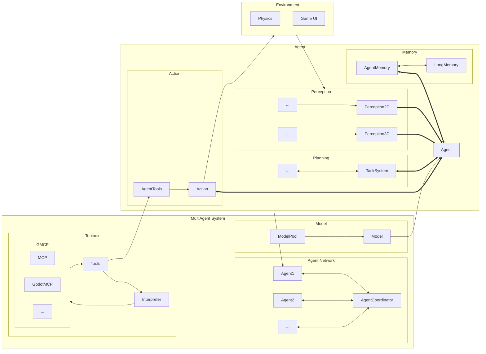
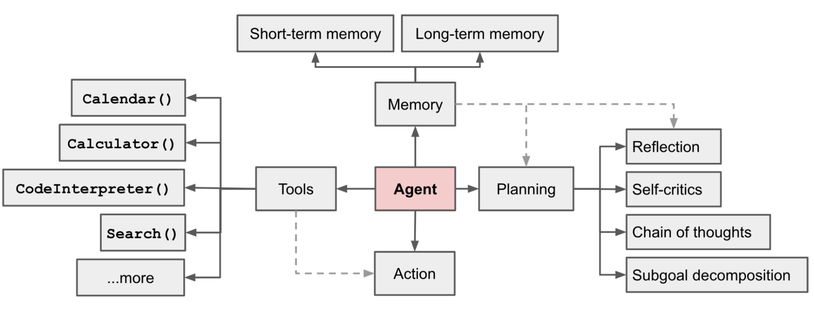

# 
AIdot

  

<!-- 

 -->

## 
Multi-Agent framework for Godot

### Framework

  by [SleeeepyZhou](https://github.com/SleeeepyZhou)

### Support
Native support [MCP (Model Context Protocol)](https://github.com/modelcontextprotocol) through [MCP-gdscript-SDK]().  

### Dependent
[MCP-gdscript-SDK]() by SleeeepyZhou MIT
[Godot-AIUtils](https://github.com/SleeeepyZhou/Godot-AIUtils) by SleeeepyZhou Apache-2.0  
[MatrixCalc](https://github.com/SleeeepyZhou/MatrixCalc) by SleeeepyZhou MIT

### Thanks
This project learns from the renowned Multi-Agent framework [Camel](https://www.camel-ai.org), and thanks to [Guohao Li](https://github.com/lightaime) and [Camel-AI](https://github.com/camel-ai) team.

The design of the agent learns from [Lilian Weng](https://github.com/lilianweng)'s article [LLM Powered Autonomous Agents](https://lilianweng.github.io/posts/2023-06-23-agent/).  

  

