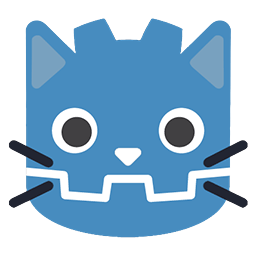

# 
AIdot

  

## 
Multi-Agent framework for Godot

  by [SleeeepyZhou](https://github.com/SleeeepyZhou)

### Framework

### Dependent
[Godot-AIUtils](https://github.com/SleeeepyZhou/Godot-AIUtils) by SleeeepyZhou Apache-2.0

### Thanks
This project learns from the renowned Multi-Agent framework [Camel](https://github.com/camel-ai/camel), 
and thanks to [Guohao Li](https://github.com/lightaime) and [Camel-AI](https://github.com/camel-ai) team.
