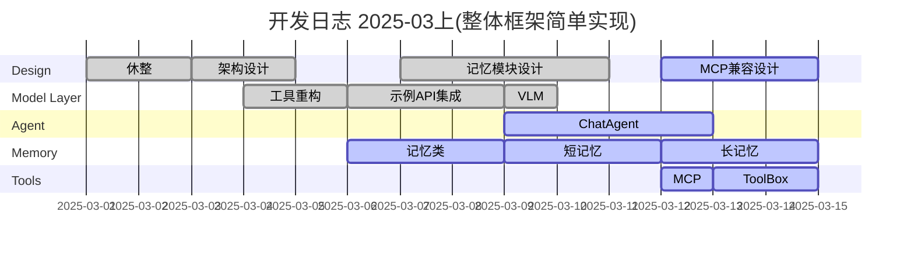
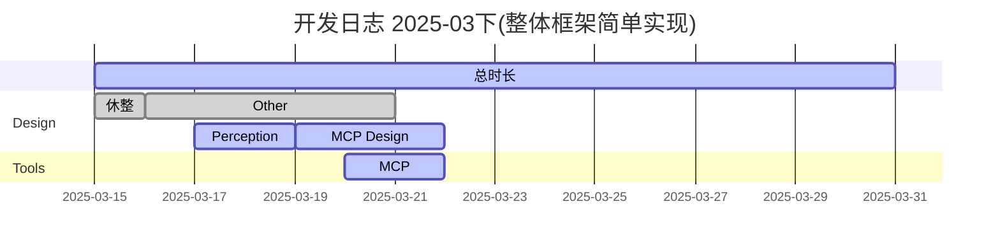

## Future solutions:   

- [ ] 各级UI

#### Agents  
- [ ] 关系网系统

#### ModelLayer  
- [ ] 每个Model的UI图标  
- [ ] 流式传输支持  
- [ ] ModelLayer性能优化  

#### Memory  
- [ ] RAG原生支持  

#### Tools  
- [ ] 支持Godot本地MCP服务  

#### Perception  
- [ ] 支持更多感知能力  

#### Planning  
- [ ] 任务管理  

