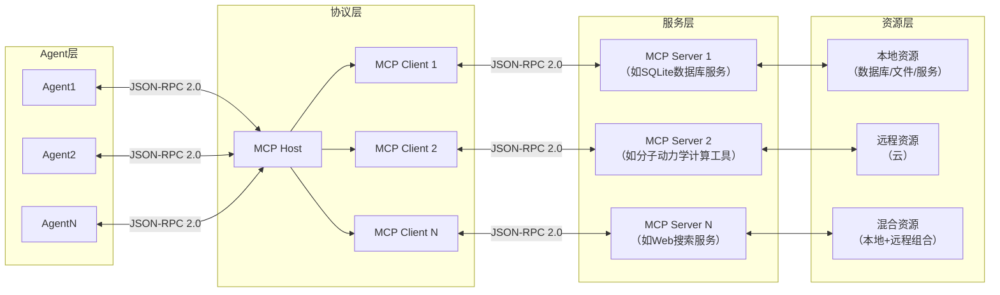

```mermaid
graph LR
    subgraph "Agent层"
        Agent1
        Agent2
        AgentN
    end

    subgraph "协议层"
        MCP_Host[MCP Host] --> MCP_Client1[MCP Client 1]
        MCP_Host --> MCP_Client2[MCP Client 2]
        MCP_Host --> MCP_ClientN[MCP Client N]
    end
    Agent1 <-->|JSON-RPC 2.0| MCP_Host
    Agent2 <-->|JSON-RPC 2.0| MCP_Host
    AgentN <-->|JSON-RPC 2.0| MCP_Host

    subgraph "服务层"
        MCP_Client1 <-->|JSON-RPC 2.0| MCP_Server1[MCP Server 1<br>（如SQLite数据库服务）]
        MCP_Client2 <-->|JSON-RPC 2.0| MCP_Server2[MCP Server 2<br>（如分子动力学计算工具）]
        MCP_ClientN <-->|JSON-RPC 2.0| MCP_ServerN[MCP Server N<br>（如Web搜索服务）]
    end

    subgraph "资源层"
        direction LR
        MCP_Server1 <--> Local_Resources[本地资源<br>（数据库/文件/服务）]
        MCP_Server2 <--> Remote_Resources[远程资源<br>（云）]
        MCP_ServerN <--> Hybrid_Resources[混合资源<br>（本地+远程组合）]
    end

```