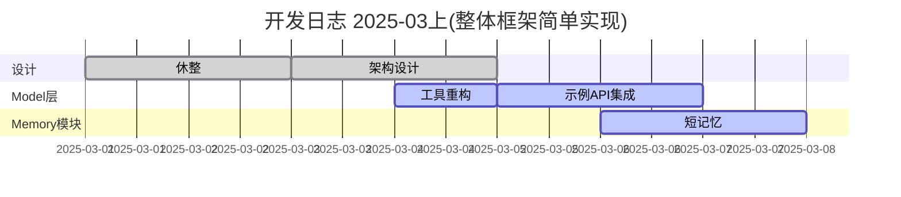

```mermaid
---
displayMode: compact
---
gantt
	title 开发日志 2025-03上(整体框架简单实现)
	dateFormat  YYYY-MM-DD
	section 设计
	休整 :done, 2025-03-01, 2d
	架构设计 :done, 2025-03-03, 2d
	section Model层
	工具重构 :active, 2025-03-04, 1d
	示例API集成 :active, 2025-03-05, 2d
	section Memory模块
	短记忆 :active, 2025-03-06, 2d
```
