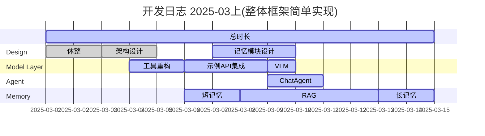
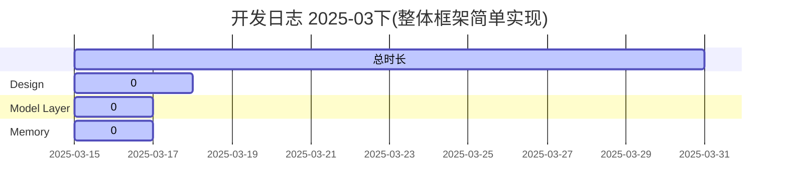

```mermaid
---
displayMode: compact
---
gantt
	title 开发日志 2025-03上(整体框架简单实现)
	dateFormat  YYYY-MM-DD
	总时长 :active, 2025-03-01, 14d
	section Design
	休整 :done, 2025-03-01, 2d
	架构设计 :done, 2025-03-03, 2d
	记忆模块设计 :active, 2025-03-07, 3d
	section Model Layer
	工具重构 :active, 2025-03-04, 2d
	示例API集成 :active, 2025-03-06, 3d
	VLM :active, 2025-03-09, 1d
	section Agent
	ChatAgent :active, 2025-03-09, 2d
	section Memory
	短记忆 :active, 2025-03-06, 2d
	RAG :active, 2025-03-08, 5d
	长记忆 :active, 2025-03-13, 2d
	section Action
	section Perception
	section Planning
	section Tools
```

```mermaid
---
displayMode: compact
---
gantt
	title 开发日志 2025-03下(整体框架简单实现)
	dateFormat  YYYY-MM-DD
	总时长 :active, 2025-03-15, 16d
	section Design
	0 :active, 2025-03-15, 3d
	section Model Layer
	0 :active, 2025-03-15, 2d
	section Agent
	section Memory
	0 :active, 2025-03-15, 2d
	section Action
	section Perception
	section Planning
	section Tools
```