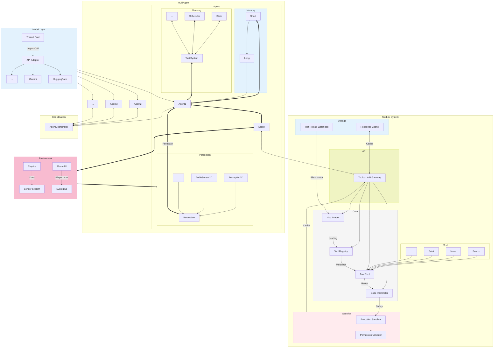

```diff
AIdot/
├── Lib/                                # 核心框架
│   ├── Agent/
│   │   ├── Core/                       # 基础组件
│   │   │   ├── BaseAgent.gd            # 继承Node，存储ID、状态等
│   │   │   └── ChatAgent.gd            # 继承BaseAgent，最简单的对话Agent
│   │   └── Abilities/                  # 能力组件（可插拔）
│   │       ├── Perception/
│   │       │   ├── Perception.gd       # 感知器集成
│   │       │   ├── Perception2D.gd     # 继承Area2D实现碰撞等感知
│   │       │   └── AudioSensor2D.gd    # 继承AudioListener2D实现声音感知
│   │       ├── Memory/
│   │       │   ├── Memory.gd           # Memory集成，集成记忆方法
│   │       │   ├── Short.gd            # 短记忆
│   │       │   └── Long.gd             # 长记忆
│   │       ├── Action/
│   │       │   ├── Func.gd             # Function Call
│   │       │   └── Interpreter.gd      # 代码Interpreter
│   │       └── Planning/
│   │           ├── State.gd            # 状态
│   │           ├── Scheduler.gd        # 任务队列
│   │           └── TaskSystem.gd       # 任务管理系统
│   ├── Model/                          # 模型接口
│   │   ├── API_Adapter                 # API适配
│   │   │   ├── API.gd                  # API统一接口
│   │   │   └── Pool.gd                 # 调用线程池
│   │   ├── LLM.gd                      # LLM类
│   │   └── VLM.gd                      # VLM类
│   └── Tools/
│       ├── ToolCore.gd                 # 工具基类
│       └── Modules/                    # 具体工具实现
│           ├── WebSearch/
│           │   ├── modinf.json         # 工具信息
│           │   └── WebSearch.gd
│           ├── Paint/
│           │   ├── modinf.json         # 工具信息
│           │   └── StableDiffusion.gd
│           └── GameAPI/
│               ├── modinf.json
│               └── Key.gd
├── Res/
│   ├── Agents/                         # Agent预设
│   │   ├── RPG_Guard.gd                # 预设的警卫Agent
│   │   └── RPG_Guard.tscn
│   ├── Data/                           # 各类数据文件
│   │   └── sys_prompt.json             # 预设Prompt数据
│   └── UI/                             # 框架专用UI素材
│       └── Icon.png                    # 项目图标
├── Utils/
│   ├── ImageEncoder.gd                 # 图片转Base64
│   └── Log.gd                          # 日志工具
└── Main/                               # 演示与集成
	├── Autoloads/                      # 自动加载单例
	│   ├── AgentCoordinator.gd         # Agent协调中心
	│   └── Toolbox.gd                  # 全局工具访问入口
	└── Demo/                           # 示例场景
		└── Demo.tscn
```



